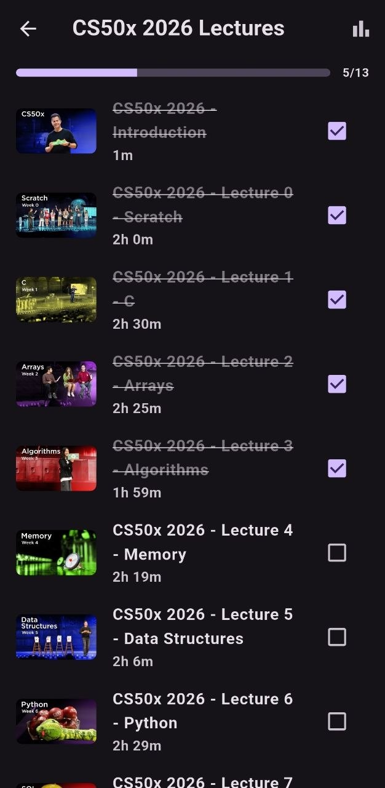
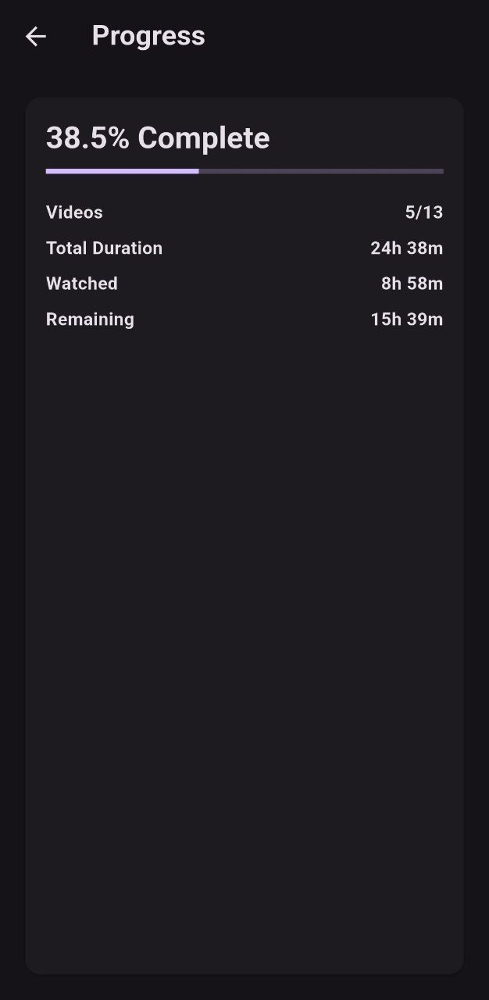

<div align="center">

# Course Tracker

An open-source Flutter application to track your progress through YouTube educational playlists and courses. 



</div>

# Course Tracker

Course Tracker is a privacy-first, fully local application that allows you to import YouTube playlists and track your learning progress. Instead of relying on YouTube's watch history which can get cluttered, Course Tracker gives you a dedicated space to manage your educational content.

<div align="center">

</div>

## Features

- **Progress Tracking**: See exactly how many videos you've completed and your percentage progress through a course.
- **Multiple Playlists**: Import and manage multiple courses simultaneously.
- **Offline Storage**: All your progress and data is stored locally on your device using Hive.
- **Deep Linking**: Tap any video to seamlessly open and watch it directly in the YouTube app.
- **Dark Mode**: Built-in support for system light/dark themes.
- **Custom API Keys**: Use your own YouTube Data API v3 key for importing playlists.

<br />

## Why use Course Tracker?

When learning from long YouTube courses (like 50+ video programming tutorials), it's easy to lose your place or forget which videos you've actually finished vs just clicked on. 

Course Tracker solves this by letting you explicitly mark videos as watched via a simple swipe gesture, completely independent of your YouTube account history.

<br />

## Getting Started

### Prerequisites
- Flutter SDK (latest stable version)
- A YouTube Data API v3 Key

### Installation

1. Clone the repository
```bash
git clone https://github.com/yourusername/course_tracker.git
cd course_tracker
```

2. Install dependencies
```bash
flutter pub get
```

3. Run the app
```bash
flutter run
```

### Setting up the API Key
When you first launch the app, click the 🔑 (key) icon in the top right corner and paste your YouTube Data API v3 key to enable playlist importing.

### Where get YouTube Data API v3 key?
1. Create a Project:
     - Go to the [Google Cloud Console](https://console.cloud.google.com)

    - Click the project dropdown (top left) and select New Project. Give it a name and click Create

2. Enable the API:
    - In the top search bar, type "YouTube Data API v3" and select it from the results
    - Click the blue Enable button

3. Create Credentials:
    - Once enabled, click the Credentials tab on the left-hand sidebar (or search for "Credentials" in the top bar)
    - Click + Create Credentials at the top and select API key
    A dialog will appear with your new API key. Copy this key

4. Restrict Your Key (Recommended):
    - To prevent unauthorized use, click Edit API key in the confirmation dialog
    - Under API restrictions, select Restrict key
    - Choose YouTube Data API v3 from the dropdown and save your changes
5. Paste the copied key into app

<br />

---

## Security

All your data (including your API key) is stored locally on your device. The app makes network requests directly to the YouTube API, with no intermediary servers.
